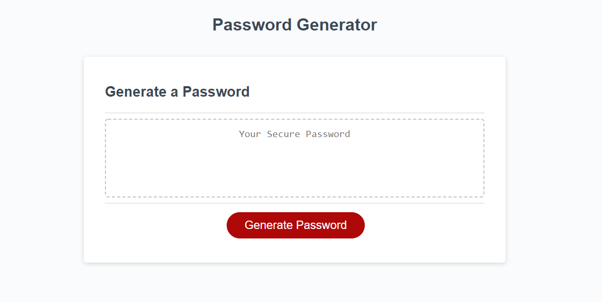
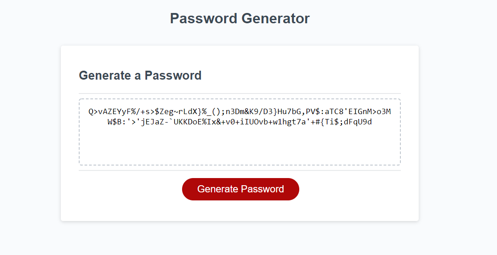

# JavaScript Password Generator
## by Michael Bussert
### GitHub: [mbussert](https://github.com/mbussert) | Email: mbussert@gmail.com

## Links:
Deployed application: https://mbussert.github.io/password-generator/  
GitHub Repository: https://github.com/mbussert/password-generator

## Description:
---------------------------------
Using the files given, I created a simple JavaScript password generator capable of generating passwords between 8 and 128 characters long using lower case and upper case alphanumeric characters, numbers, symbols, or any combination thereof.  The prompts have built-in data validation as well.

----------------------------------------
## Screenshots

### Pageload 

### 120 Character Password Generated
